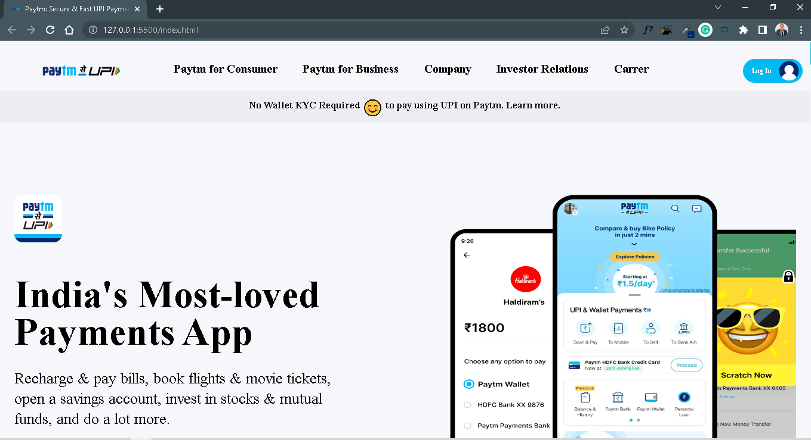

# Paytm UI CLone

# Project [Deployed Link](https://deepakpaytmuiclone.netlify.app/)

- What did I learn from this Project?
  -
  - Learned how to make fully responsive website using TailwindCSS.
  - Learned how to make a full fledged website end to end.
  - Learned tailwind different properties and how to use them.

---

## Time taken to finish this project

- it took me more than 3 days to complete it.

---

## ScreenShot

